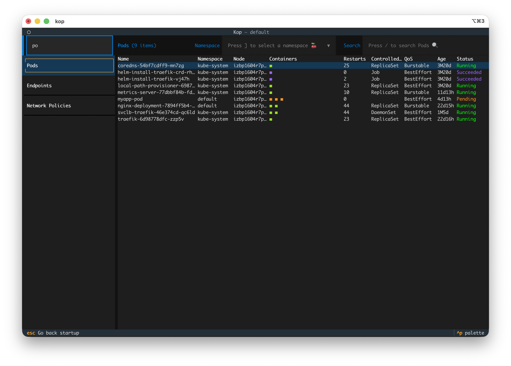
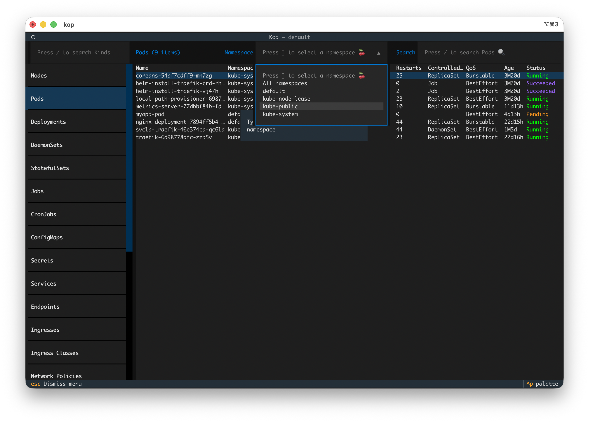
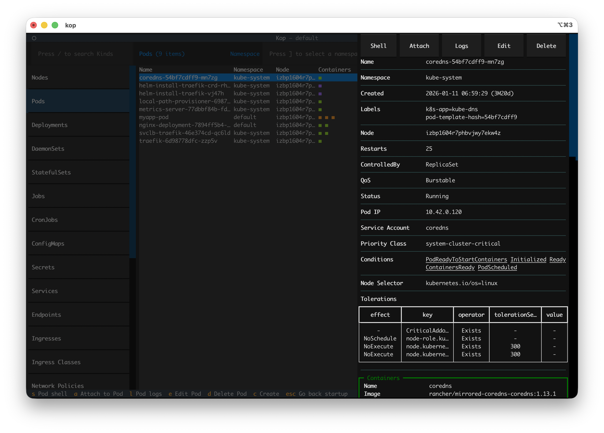
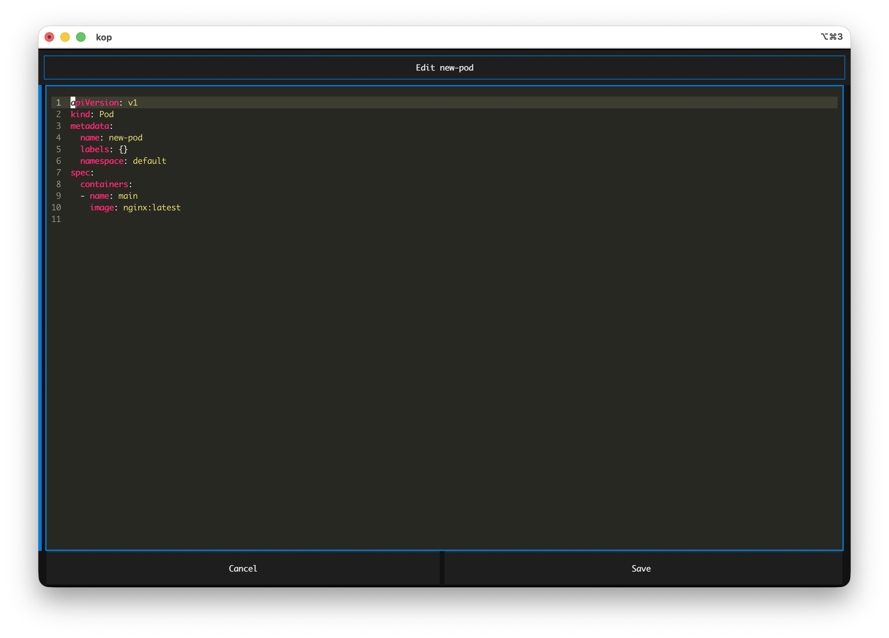
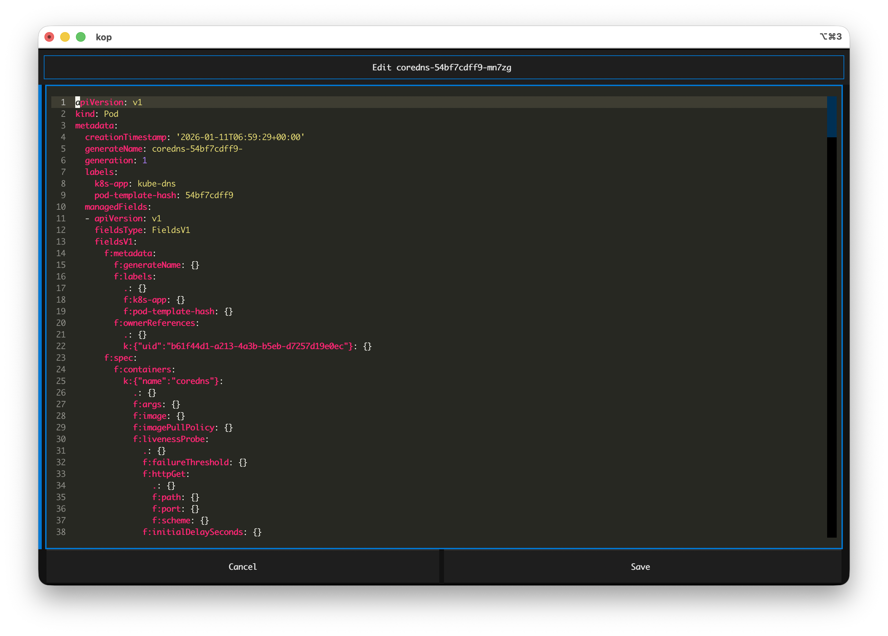
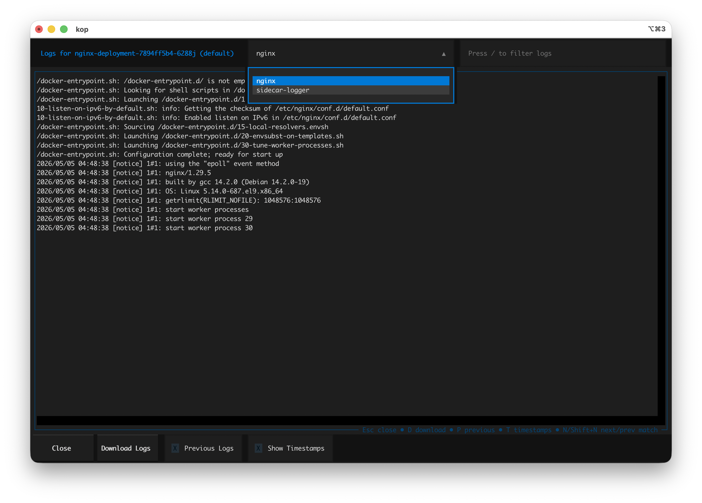
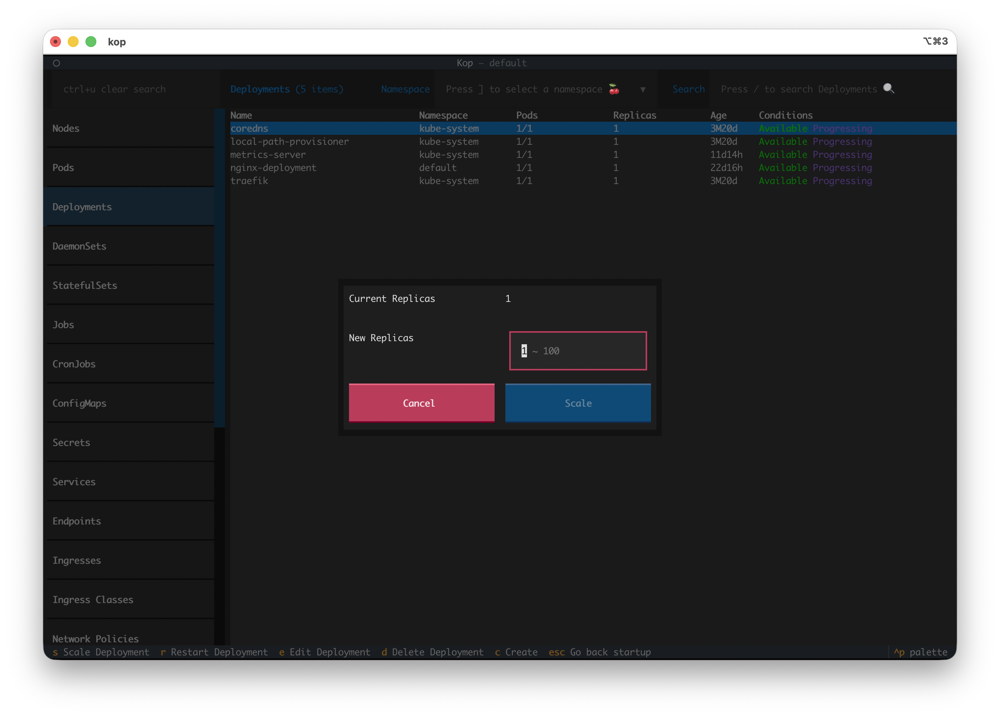

# Guide

This guide contains task-oriented instructions for working with Kubernetes resources in `kop`.

## Find resource kinds in navigator 

Use navigator search to quickly locate Kubernetes kinds in the left panel.

1. Click the search box at the top of the navigator with your mouse or Press `/` to focus the search box.
2. Type a keyword (for example: `pod`, `ingress`, `role`).
3. Use `Up`/`Down` to move in filtered results.
4. Press `Enter` to open the selected kind.

Tip

Use `Ctrl+U` (or clear input) to reset the full kind list.

## Find resources by namespace and keyword

Use namespace selection and resource search to narrow the table.

1. Open a resource kind from navigator.
2. Press `]` to focus the namespace selector.
3. Select one namespace, or keep `All namespaces`.
4. Press `/` in the right panel and type a search keyword.
5. Review filtered results in the table and open details with `Enter`.

Note

> For `nodes` (cluster-scoped), namespace filtering is hidden.

> By default, resources from all namespaces are displayed. 

## View resource details
All resources in kop support viewing their detail information.

1. Use the `'↑↓'` key or click to select the resource.
2. Press `Enter` to open the detail side view.

## Create a resource

Create resources from YAML in `kop`.

1. Choose a resource kind in navigator.
2. Press the `'c'` key to open the creation editor and automatically populate the template for the kind you choose.
3. Edit YAML after click [Save] button or `'ctrl+s'` to save.
4. Confirm the success notification and validate in the resource table.

Note

> Built-in templates are available for: `pods`, `deployments`, `daemonsets`, `statefulsets`, `jobs`, `cronjobs`, and `configmaps`.

> kop supports creating resources by entering multiple resource YAML files in a single edit box; each resource's content can be separated using `'---'`.

## Edit resource

Most kinds support edit.

1. Select a resource use `'↑↓'`.
2. Press `e` to edit YAML, click `[Save]` button or 'ctrl+s' to save.
3. Wait for the list to refresh and check status/events.

## Open Pod logs

View logs from pod containers.

1. Open `Pods` and select pod resource.
2. Press `l` (`Logs`).
3. Press `]` to switch other container in top panel.
4. Press `/` to search log context in top panel, If multiple entries are matched, press `n`/`shift+n` to move the cursor between the next/previous entry. 
5. Press `p` to toggle `previous` logs.
6. Press `t` to show log timestamps
7. Press `d` to download logs to local

Note

Logs are fetched directly from Kubernetes API. For restarted containers, `kop`
lets you choose `current` or `previous` logs.

## Open Pod shell

Start an interactive shell session inside a running pod container.

1. Open `Pods` and select pod resource.
2. Press `s` (`Shell`).
3. If multiple containers exist, choose one container.
4. Run commands in the terminal screen.

Note

Shell is available only when pod status is `Running`.

## Attach to a Pod process

Attach to a running container process directly.

1. Open `Pods` select pod resource.
2. Press `a` (`Attach`).
3. If multiple containers exist, choose one container.

Note

Attach is available only when pod status is `Running`.

## Scale a Deployment or StatefulSet

Scale workload replicas without using `kubectl`.

1. Open `Deployments` or `StatefulSets`.
2. Select a resource or click open details.
3. Press `s` (`Scale`).
4. Enter target replicas and confirm.
5. Verify updated replicas in table/details.

## Restart a Deployment, DaemonSet, or StatefulSet

Trigger a rolling restart from the action panel.

1. Open `Deployments`, `DaemonSets`, or `StatefulSets`.
2. Select a resource or click open details.
3. Press `r` (`Restart`).
4. Confirm restart in the dialog.
5. Check pod rollout progress in related workloads.

## Trigger or suspend a CronJob

Manage CronJob execution from the details panel.

1. Open `CronJobs`.
2. Select a cronjob or click open details.
3. Press `t` to trigger a one-off job.
4. Press `s` to suspend or resume scheduling.
5. Verify result in notifications and table fields.

## Run node maintenance actions

Operate node lifecycle actions from `Nodes`.

1. Open `Nodes`.
2. Select a node and open details.
3. Press `s` for node shell.
4. Press `c` for cordon.
5. Press `r` for drain.
6. Press `e` for edit, or `d` for delete.

Note

> Drain first cordons the node, then evicts eligible pods (DaemonSet/mirror pods are skipped).

> Executing a node shell requires starting a debug pod. This pod is a tool container for node-level debugging, scheduled to run on a specified Node, and mounted to the host machine's root directory (/) via hostPath, while also enabling hostPID and hostNetwork. The container runs in privileged mode, allowing users to access and manipulate host machine resources after entering the container (similar to directly logging into the node to execute a shell).

## Set the default IngressClass

Mark one ingress class as cluster default.

1. Open `Ingress Classes`.
2. Select a class or click open details.
3. Press `s` (`Set Default`).
4. Confirm the action.
5. Verify the default annotation on the selected class.

## Resource actions reference

The following kinds are available in navigator:

- `nodes`
- `pods`
- `deployments`
- `daemonsets`
- `statefulsets`
- `jobs`
- `cronjobs`
- `configmaps`
- `secrets`
- `services`
- `endpoints`
- `ingresses`
- `ingressclasses`
- `networkpolicies`
- `persistentvolumes`
- `persistentvolumeclaims`
- `storageclasses`
- `namespaces`
- `serviceaccounts`
- `roles`
- `rolebindings`
- `clusterroles`
- `clusterrolebindings`

Per-kind actions:

- `nodes`: `shell (s)`, `cordon (c)`, `drain (r)`, `edit (e)`, `delete (d)`
- `pods`: `shell (s)`, `attach (a)`, `log (l)`, `edit (e)`, `delete (d)`
- `deployments`: `scale (s)`, `restart (r)`, `edit (e)`, `delete (d)`
- `daemonsets`: `restart (r)`, `edit (e)`, `delete (d)`
- `statefulsets`: `scale (s)`, `restart (r)`, `edit (e)`, `delete (d)`
- `jobs`: `edit (e)`, `delete (d)`
- `cronjobs`: `trigger (t)`, `suspend/resume (s)`, `edit (e)`, `delete (d)`
- `ingressclasses`: `set_default (s)`, `edit (e)`, `delete (d)`
- all other listed kinds: `edit (e)`, `delete (d)`
