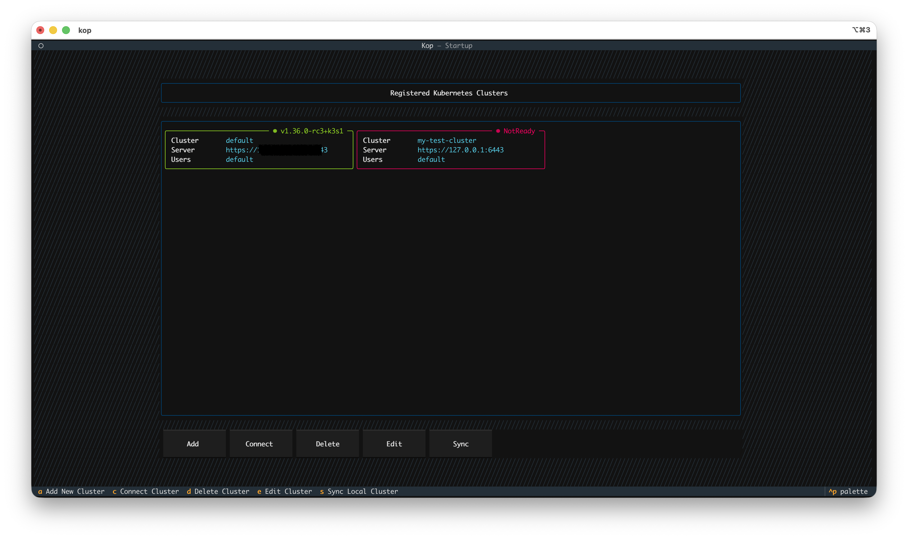
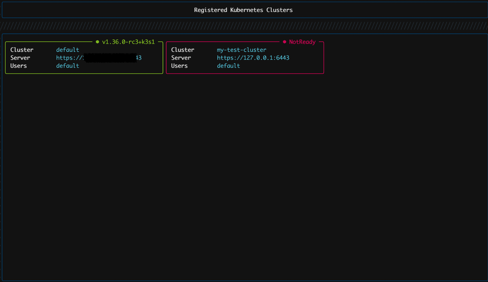
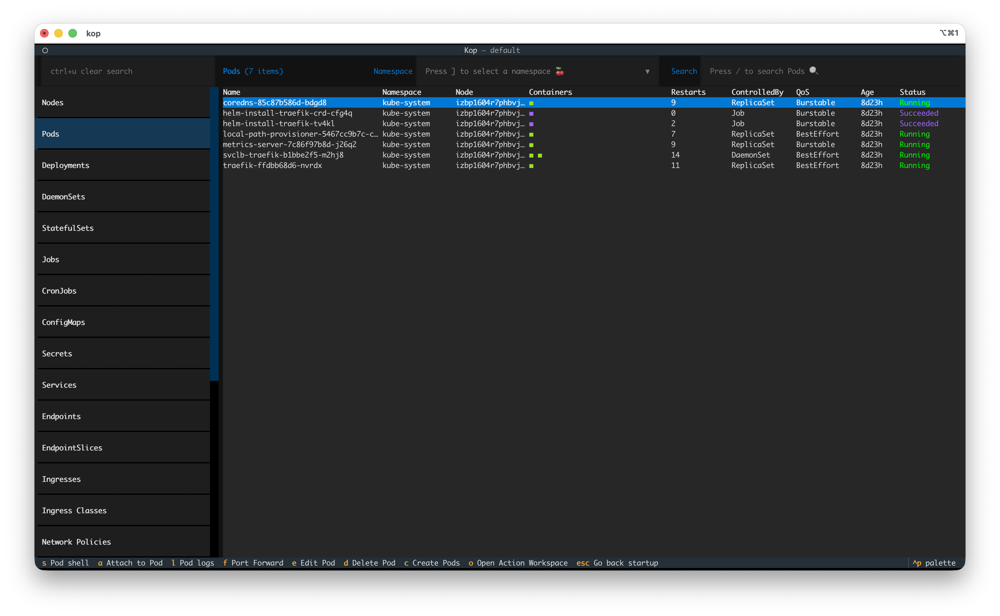
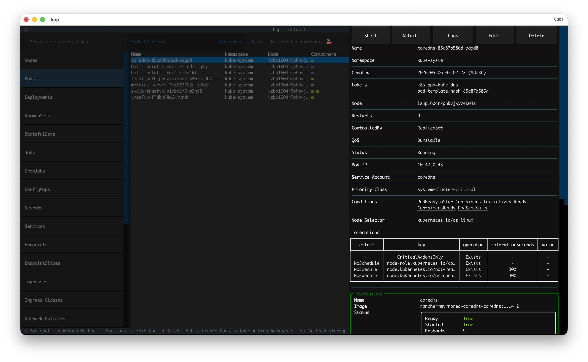
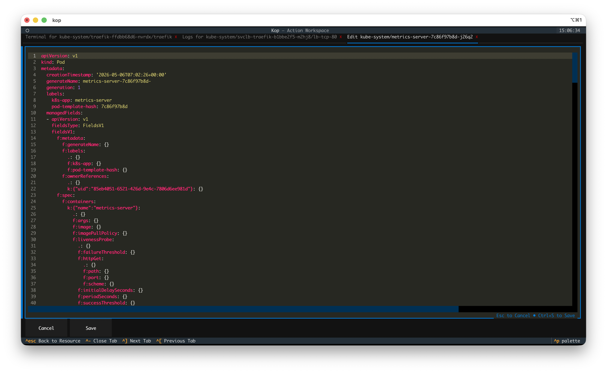
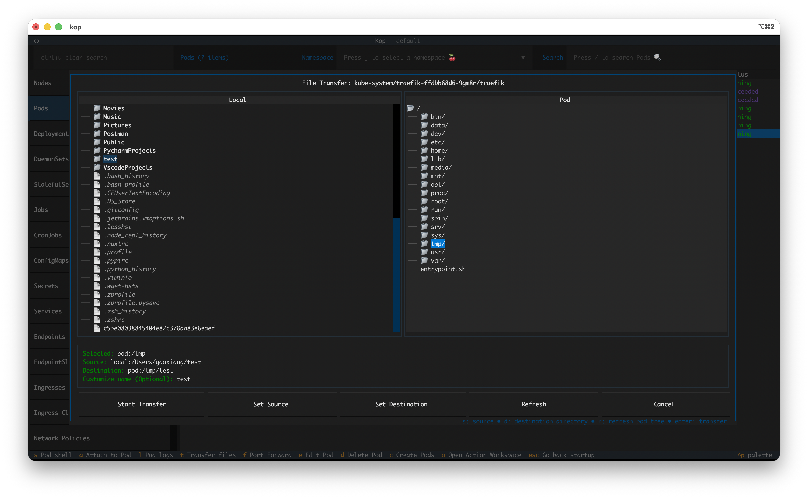
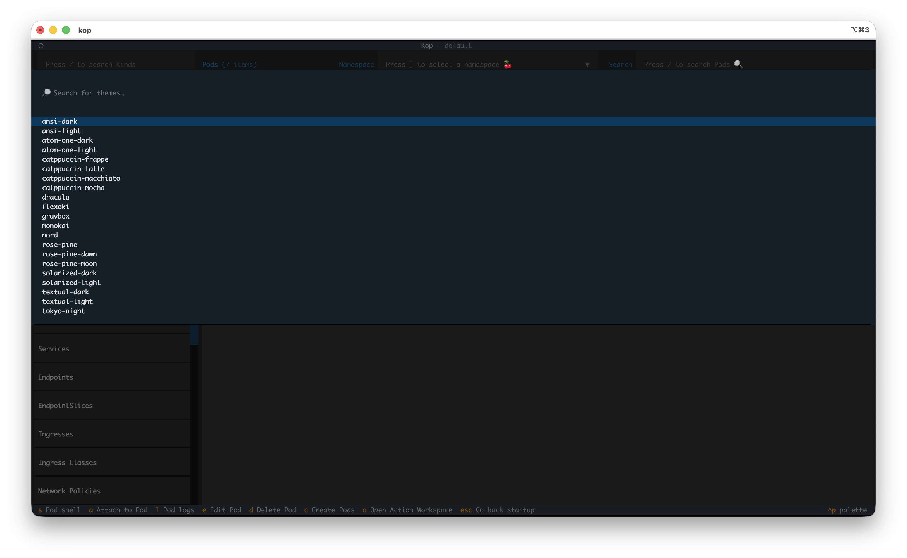
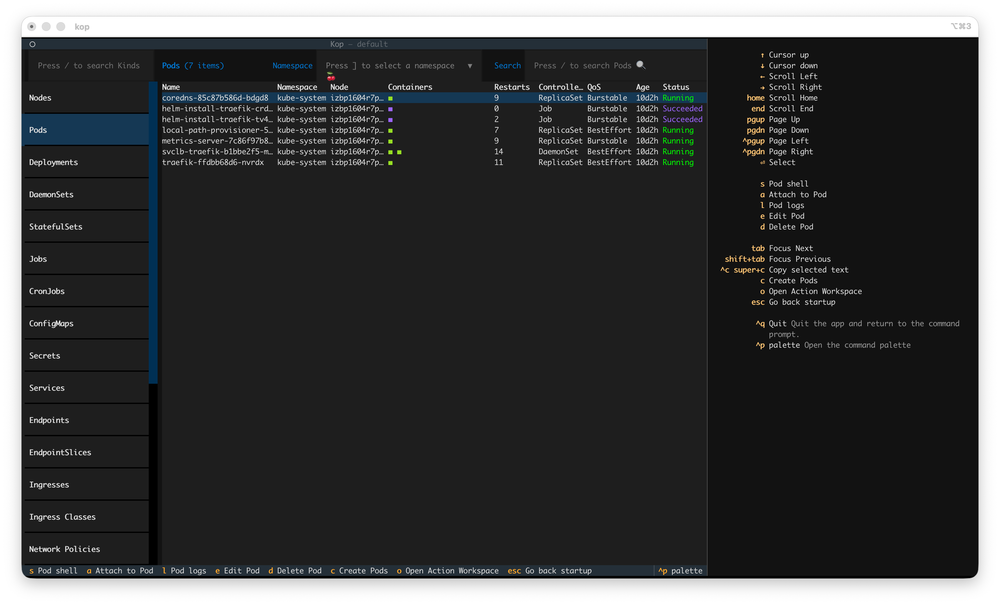

---
hide:
  - navigation
---

# Tutorial

## Terminal UI
Kop uses the Textual TUI framework to render the UI, so Kop runs in the terminal.

### Startup View
The image below shows the Kop startup screen, called `Startup View`.

The Startup interface is mainly composed of the following areas:

The top header, titled "kop - Startup," indicates that the current Kop interface is the Startup section.

The middle cluster display area shows all Kubernetes clusters registered with Kop.
Below the cluster list is a row of buttons: `[Add]` `[Connect]` `[Delete]` `[Edit]` `[Sync]` These buttons can be clicked with the mouse.

The bottom footer, a shortcut area, displays all the features supported by the current Startup page.corresponding to the functions in the button area above.You can also click the shortcuts if you wish.

#### Registered kubernetes cluster
You may have noticed that there are two Kubernetes clusters in the `Registered Kubernetes clusters` area, indicated by green and red borders respectively. A green border means that kop can connect to the cluster successfully, and the cluster version information is displayed in the upper right corner of the green border. A red border indicates that kop cannot connect to the cluster, and "`NotReady`" is displayed in the upper right corner.

### Resource View

After connecting to a cluster, kop enters the cluster resource screen, called `Resource View`.

The Resource View interface is mainly composed of the following areas:

The top header, titled kop - default, The name used to identify the currently connected Kubernetes cluster.

The left-side navigator is used to select Kubernetes resource kinds (for example: Pods, Deployments, Services, and others).

The center list area displays objects of the selected resource kind.
You can filter resources by namespace and search by keyword.

The bottom footer, a shortcut area, displays the available keys for the current page.

### Detail View
Clicking on a resource in the Resource View or pressing the Enter key will display detailed information about that resource in the right sidebar, which is called the `Detail View`. This view centralizes key resource information (such as metadata, status, spec, and related events).

The detail view can be scrolled vertically; scrolling down will show you more information.

### Action Workspace
When you modify or edit resource YAML files, create new resources, or view pod logs, and simultaneously interact with the pod terminal, all these operations are concentrated in a single interface called the `Action Workspace`. It's a multi-tasking workspace that allows you to freely switch between different workloads.

The top header, titled is "kop - Action Workspace," used to identify the current Action workspace.

Below the header is action tabs; you can use `Ctrl+[`  or `ctrl+]` to switch between different action.

The middle section shows the current action workspace. Below are the keyboard shortcuts for actions within the workspace.

## Transfer Files
Transfer files allows users to transfer files between their local machine and their pod.

Please see the usage instructions: [Transfer Files](guide/Pods.md#transfer-files)

## Theme
Kop uses Textual to build its user interface and includes multiple modern themes. Press `Ctrl+P` in Kop will directly bring up the theme list, allowing you to select any theme.

## Keys
Each screen has different functions, and each function has a corresponding keyboard shortcut, which can be seen in the Footer at the bottom of the screen. However, some shortcuts are not displayed in the Footer or only appear under specific conditions. To see which shortcuts are supported on the current screen, use the `Keys` feature, which will display all the shortcuts for the current screen.

Press `Ctrl+P`, select `Keys`, and you will see all the keyboard shortcuts in the right-side drawer.