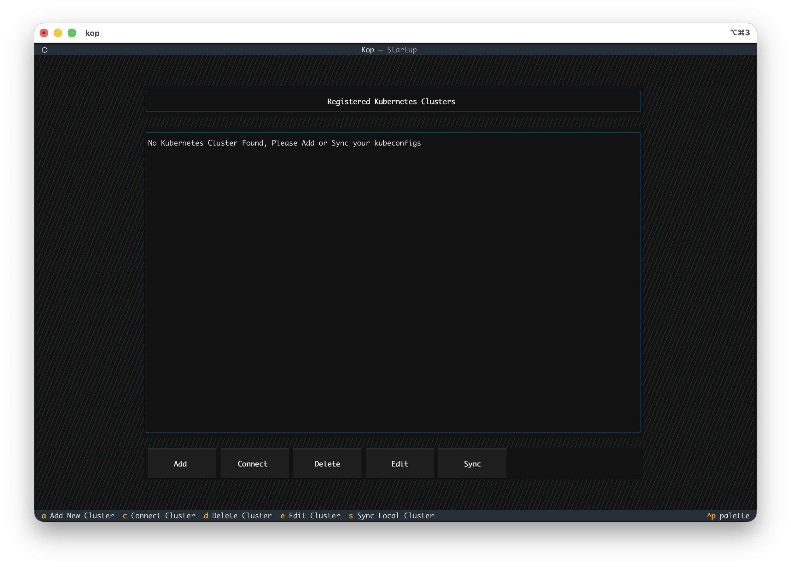
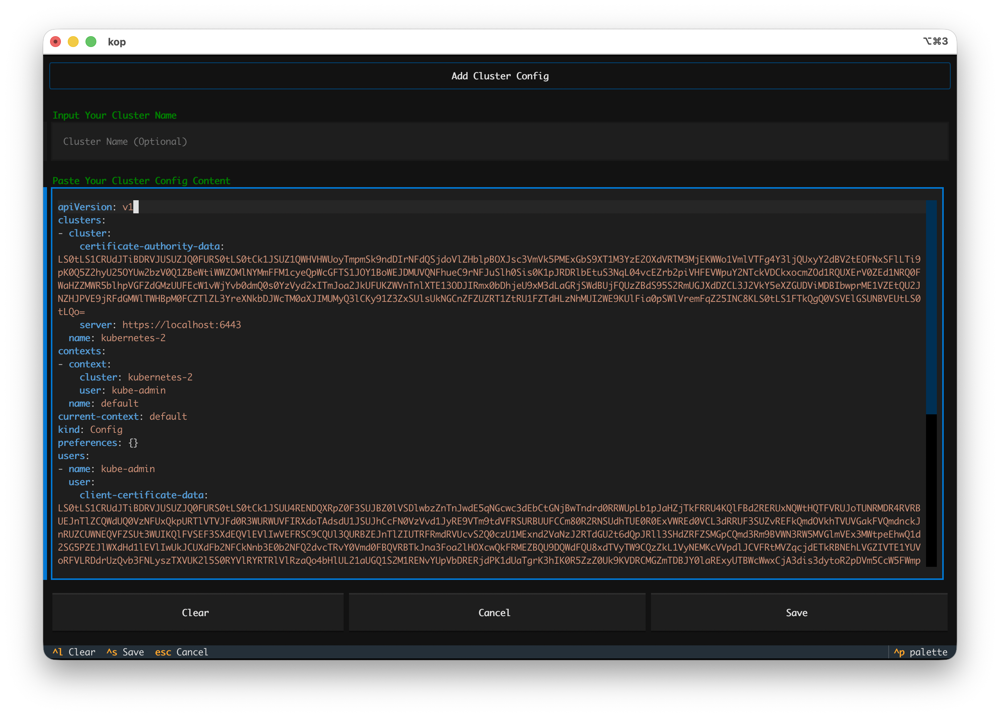

# Tutorial

## Terminal UI
Kop uses the Textual TUI framework to render the UI, so Kop runs in the terminal.

### Startup View
The image below shows the Kop startup screen, called `Startup View`.

The Startup interface is mainly composed of the following areas:

The top header, titled "kop - Startup," indicates that the current Kop interface is the Startup section.

The middle cluster display area shows all Kubernetes clusters registered with Kop.
Below the cluster list is a row of buttons: `[Add]` `[Connect]` `[Delete]` `[Edit]` `[Sync]` These buttons can be clicked with the mouse.

The bottom footer, a shortcut area, displays all the features supported by the current Startup page.corresponding to the functions in the button area above.You can also click the shortcuts if you wish.

#### Registered kubernetes cluster
You may have noticed that there are two Kubernetes clusters in the `Registered Kubernetes clusters` area, indicated by green and red borders respectively. A green border means that kop can connect to the cluster successfully, and the cluster version information is displayed in the upper right corner of the green border. A red border indicates that kop cannot connect to the cluster, and "`NotReady`" is displayed in the upper right corner.

### Resource View

After connecting to a cluster, kop enters the cluster resource screen, called `Resource View`.

The Resource View interface is mainly composed of the following areas:

The top header, titled kop - default, The name used to identify the currently connected Kubernetes cluster.

The left-side navigator is used to select Kubernetes resource kinds (for example: Pods, Deployments, Services, and others).

The center list area displays objects of the selected resource kind.
You can filter resources by namespace and search by keyword.

The bottom footer, a shortcut area, displays the available keys for the current page.

### Detail View
Clicking on a resource in the Resource View or pressing the Enter key will display detailed information about that resource in the right sidebar, which is called the `Detail View`.

The detail view can be scrolled vertically; scrolling down will show you more information.

### Action Workspace
When you modify or edit resource YAML files, create new resources, or view pod logs, and simultaneously interact with the pod terminal, all these operations are concentrated in a single interface called the `Action Workspace`. It's a multi-tasking workspace that allows you to freely switch between different workloads.

The top header, titled is "kop - Action Workspace," used to identify the current Action workspace.

Below the header is a action tab; you can use `Ctrl+[`  or `ctrl+]` to switch between different action.

The middle section shows the current action workspace. Below are the keyboard shortcuts for actions within the workspace.

## Add Kubernetes CLuster

After starting kop, it reads the ~/.kube/config file by default.

> ~/.kube/config is the default configuration file for Kubernetes (often called the kubeconfig file). It contains information about connecting to and authenticating the Kubernetes cluster (such as API server addresses, certificates, and tokens) and context information. The kubectl command-line tool uses this file by default to communicate with the cluster and manages access information for multiple clusters, users, and namespaces.

If the host running kop does not have Kubernetes (connecting to a remote Kubernetes cluster over the network). After starting kop, you will see relevant prompts.

At this point, you can open the `Add Cluster` view by clicking the `[Add]` button with the mouse or pressing `a` on the keyboard.

Then paste the contents of your kubeconfig file into the `Paste Your Cluster Config` area. Then paste the contents of your kubeconfig file into the content area, and then click the `[Save]` button or press `'ctrl+s'` to save.

### Multiple clusters exist in kubeconfig
If a kubeconfig file contains multiple cluster configurations, Kop will split the kubeconfig according to the cluster dimension when importing it. After successful import, multiple clusters will be imported into the Kop cluster view.

## Sync kubeconfig
kop supports selecting the kubeconfig file for synchronous cluster configuration. It also supports directory synchronization, allowing you to place multiple kubeconfig files in the same directory. kop will then synchronize all valid kubeconfig files in that directory.

In the startup view, press the `[Sync]` button or the `'s' ` key to enter the kubeconfig file selection view.

## Edit Cluster
In the `Startup` view, after selecting a cluster, you can edit the cluster by clicking the `[Edit]` button or pressing the `'e'` key.

## Delete Cluster
In the `Startup` view, after selecting a cluster, you can delete the selected cluster by clicking the `[Delete]` button or pressing the `'d'` key.

## Connect Cluster
In the `Startup` view, after selecting the target cluster, connect to the cluster by clicking the `[Connect]` button or pressing the `'c'` key. Once the connection is successful, kop will enter the cluster resource view.

>When starting kop, specify the cluster configuration file using `--kubeconfig /path/to/kubeconfig`. kop will then use this file to directly access the Kubernetes resource view.
